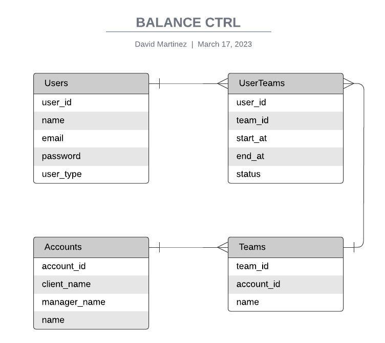

# Project Name

Rails API that enables you to make CRUD operations over users, accounts,
teams and logs the history between users and teams.

## Table of Contents

- [Diagram](#Diagram)
- [Installation](#installation)
- [Usage](#usage)
- [Endpoints](#endpoints)
- [Authentication](#authentication)
- [Testing](#testing)
- [Contributing](#contributing)
- [License](#license)

## Diagram




## Installation

1. Clone the repository.
2. Run `bundle install` to install the project's dependencies.
3. Run `rails db:create db:migrate` to create the database and run migrations.
4. Start the server by running `rails s`.

## Usage

To retrieve a list of all resources, send a GET request to `/resources`. To retrieve a specific resource, send a GET request to `/resources/:id`.

To create a new resource, send a POST request to `/resources` with the resource attributes in the request body.

## Endpoints

In order to list all the available endpoints run: 

```
rails routes -E
```

## Authentication

To authenticate, send a POST request to `/api/v1/auth/sign_in` with a JSON payload containing the `email` and `password` fields. The API will return 3 tokens, access-toke, client and uid tokens, which should be included in the headers for all subsequent requests.

## Testing

To run the test suite, run `bundle exec rspec`.

## Contributing

Contributions are welcome! To contribute, follow these steps:

1. Fork the repository.
2. Create a new branch for your feature or bug fix.
3. Make your changes.
4. Test your changes thoroughly.
5. Submit a pull request.

## License

This project is licensed under the MIT License - see the [LICENSE.md](LICENSE.md) file for details.
